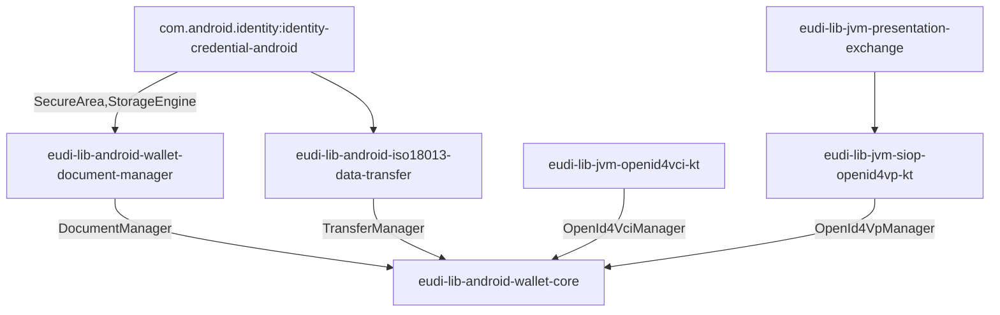

# EUDI Wallet Core library for Android

:heavy_exclamation_mark: **Important!** Before you proceed, please read
the [EUDI Wallet Reference Implementation project description](https://github.com/eu-digital-identity-wallet/.github/blob/main/profile/reference-implementation.md)

## Overview

This repository contains the EUDI Wallet Core library for Android. The library is a part
of the EUDI Wallet Reference Implementation project.

This library acts as a coordinator by orchestrating the various components that are
required to implement the EUDI Wallet functionality. On top of that, it provides a simplified API
that can be used by the application to implement the EUDI Wallet functionality.



The library provides the following functionality:

- Document management
    - [x] Storage encryption
    - [x] Using device secure area for generating/storing documents' keypair
    - [x] Enforcing device user authentication when retrieving documents' private keys
- Document issuance
    - [x] Support for OpenId4VCI Draft 13 document issuance
        - [x] Authorization Code Flow
        - [x] Pre-authorization Code Flow
        - [x] Support for mso_mdoc format
        - [ ] Support for sd-jwt-vc format
        - [x] Support credential offer
        - [x] Support for DPoP JWT in authorization
        - [x] Support for JWT and CWT proof types
      - [x] Support for deferred issuing
- Proximity document presentation
    - [x] Support for ISO-18013-5 device retrieval
        - [x] QR device engagement
        - [x] NFC device engagement
        - [x] BLE data transfer
        - [ ] NFC data transfer
        - [ ] Wifi-Aware data transfer
- Remote document presentation
    - [x] OpenId4VP document transfer
        - [x] For pre-registered verifiers
        - [x] Dynamic registration of verifiers

The library is written in Kotlin and is compatible with Java. It is distributed as a Maven package
and can be included in any Android project that uses Android 8 (API level 26) or higher.

## :heavy_exclamation_mark: Disclaimer

The released software is a initial development release version:

- The initial development release is an early endeavor reflecting the efforts of a short timeboxed
  period, and by no means can be considered as the final product.
- The initial development release may be changed substantially over time, might introduce new
  features but also may change or remove existing ones, potentially breaking compatibility with your
  existing code.
- The initial development release is limited in functional scope.
- The initial development release may contain errors or design flaws and other problems that could
  cause system or other failures and data loss.
- The initial development release has reduced security, privacy, availability, and reliability
  standards relative to future releases. This could make the software slower, less reliable, or more
  vulnerable to attacks than mature software.
- The initial development release is not yet comprehensively documented.
- Users of the software must perform sufficient engineering and additional testing in order to
  properly evaluate their application and determine whether any of the open-sourced components is
  suitable for use in that application.
- We strongly recommend not putting this version of the software into production use.
- Only the latest version of the software will be supported

## Requirements

- Android 8 (API level 26) or higher

### Dependencies

To use snapshot versions add the following to your project's settings.gradle file:

```groovy

dependencyResolutionManagement {
    repositories {
        // ...
        maven {
            url = uri("https://s01.oss.sonatype.org/content/repositories/snapshots/")
            mavenContent { snapshotsOnly() }
        }
        // ...
    }
}
```

To include the library in your project, add the following dependencies to your app's build.gradle
file.

```groovy
dependencies {
    implementation "eu.europa.ec.eudi:eudi-lib-android-wallet-core:0.11.0-SNAPSHOT"
    implementation "androidx.biometric:biometric-ktx:1.2.0-alpha05"
}
```

## How to Use

### Initialize the library

The library must be initialized before it can be used. The initialization must be done only once in
the application.

To initialize the library, you need to provide a configuration object. The configuration
object is created using the `EudiWalletConfig.Builder` class. The builder allows you to configure
the following options:

- `documentsStorageDir` method allows you to specify the directory where the documents are stored.
  The default value is the application's no-backup files directory.
- `encryptDocumentsInStorage` method allows you to specify if the documents should be encrypted in
  the storage. The default value is `true`.
- `useHardwareToStoreKeys` method allows you to specify if the StrongBox Android Keystore should be
  used, if available. The default value is `true`.
- `bleTransferMode` method allows you to specify the BLE transfer mode. The BLE transfer mode can
  be one of the following:
    + `EudiWalletConfig.BLE_SERVER_PERIPHERAL_MODE` - the device will act as a BLE server
    + `EudiWalletConfig.BLE_CLIENT_CENTRAL_MODE` - the device will act as a BLE client
      The default value is `EudiWalletConfig.BLE_SERVER_PERIPHERAL_MODE`.
- `bleClearCacheEnabled` method allows you to specify if the BLE cache should be cleared after the
  transfer. The default value is `false`.
- `userAuthenticationRequired` method allows you to specify if the user authentication is required
  when using documents' keys. The default value is `false`.
- `userAuthenticationTimeOut` method allows you to specify the user authentication timeout in
  milliseconds. If the value is 0, the user authentication is required for every use of the key;
  otherwise it's required within the given amount of milliseconds. The default value is 30000.
- `trustedReaderCertificates` method allows you to specify the list of trusted reader certificates.
  The default value is an empty list.
- `openId4VpConfig` method allows you to specify the configuration for OpenID4VP. The
  default value is null.
- `openId4VciConfig` method allows you to specify the configuration for OpenID4VCI. The default
  value is null.
- `logger` method allows you to specify the logger. If the logger is not provided, the default
  logger will be used.
- `logLevel` method allows you to specify the log level for the default logger. The default value
  is `Logger.LEVEL_ERROR`.

The following example shows how to initialize the library:

```kotlin

import eu.europa.ec.eudi.wallet.EudiWallet
import eu.europa.ec.eudi.wallet.EudiWalletConfig
import eu.europa.ec.eudi.wallet.Logger
import java.security.cert.X509Certificate

val logger = Logger { record: Logger.Record ->
    // log the record
}
val storageDir = applicationContext.noBackupFilesDir
val verifierApiUri = "https://verifier-api-uri"
val config = EudiWalletConfig.Builder(applicationContext)
    // set the log level for the default logger
    .logLevel(Logger.LEVEL_DEBUG)
    // or set a custom logger
    .logger(logger)
    .ktorHttpClientFactory {
        // Provide your own Ktor HttpClient.
        // This will be used for OpenId4VCI and OpenId4VP communication.
        // If a httpClient is not provided, the library will create a default one.
        // For every httpClientFactory, the result httpClient will be configured
        // for logging (when logLevel is set to debug) and with json content negotiation 
    }
    .bleTransferMode(
        EudiWalletConfig.BLE_SERVER_PERIPHERAL_MODE,
        EudiWalletConfig.BLE_CLIENT_CENTRAL_MODE
    )
    .trustedReaderCertificates(
        listOf<X509Certificate>(
            // list of trusted reader certificates
        )
    )
    .documentsStorageDir(storageDir)
    .encryptDocumentsInStorage(true)
    .userAuthenticationRequired(false)
    .userAuthenticationTimeOut(30_000L)
    .useHardwareToStoreKeys(true)
    .openId4VpConfig {
        withClientIdSchemes(
            listOf(
                ClientIdScheme.Preregistered(
                    listOf(
                        PreregisteredVerifier(
                            "VerifierClientId",
                            "VerifierLegalName",
                            "https://example.com"
                        )
                    )
                ),
                ClientIdScheme.X509SanDns
            )
        )
        withScheme(
            listOf(
                "eudi-openid4vp",
                "mdoc-openid4vp"
            )
        )
        withEncryptionAlgorithms(listOf(EncryptionAlgorithm.ECDH_ES))
        withEncryptionMethods(listOf(EncryptionMethod.A128CBC_HS256))
    }
    .openId4VciConfig {
        withIssuerUrl("https://issuer.example.com")
        withClientId("wallet-client-id")
        authFlowRedirectionURI("eudi-openid4ci://authorize")
        useStrongBoxIfSupported(false)
        useDPoP(false)
        parUsage(ParUsage.IF_SUPPORTED)
        proofTypes(Config.ProofType.JWT, Config.ProofType.CWT)
    }
    .build()

EudiWallet.init(applicationContext, config)
```

To initialize the library with the default configuration, you can use the following code:

```kotlin
val config = EudiWalletConfig.Builder(applicationContext).build()
EudiWallet.init(applicationContext, config)
```

Library initialization is recommended to be done in the `Application.onCreate` method.

### Manage documents

The library provides a set of methods to work with documents.

#### Listing documents

The `EudiWallet.getDocuments` method that returns the list of documents stored in the library.

The following example shows how to list issued documents:

```kotlin
val documents: List<IssuedDocument> = EudiWallet.getDocuments()
```

To list all documents, including unsigned and deferred, use the following code:

```kotlin
val documents: List<Document> = EudiWallet.getAllDocuments()
```

#### Retrieving a document

The `EudiWallet.getDocumentById` method that returns a document with the given id.

The following example shows how to retrieve a document:

```kotlin
val document = EudiWallet.getDocumentById(documentId)
```

#### Deleting a document

The `EudiWallet.deleteDocumentById` method that deletes a document with the given id.

The following example shows how to delete a document:

```kotlin
val result = EudiWallet.deleteDocumentById(documentId)

when (result) {
    is EudiWallet.DeleteDocumentResult.Success -> {
        // document deleted
    }
    is EudiWallet.DeleteDocumentResult.Failure -> {
        // error
        val cause = result.throwable
    }
}
```

#### Issuing/Adding a document

Adding a document is a two-step process. First, you need to create an unsigned document using the
method `EudiWallet.createDocument`. The unsigned document holds the public certificate
that will be used by the issuer to sign the document.

Later, when document's data is available, you can create the document using the
method `EudiWallet.storeIssuedDocument` to add the document to document storage.

The following example shows how to add a document:

```kotlin
val docType = "eu.europa.ec.eudi.pid.1"
val hardwareBacked = false
val attestationChallenge = byteArrayOf(
    // attestation challenge bytes
    // provided by the issuer
)
val result = EudiWallet.createDocument(docType, hardwareBacked, attestationChallenge)
when (result) {
    is CreateDocumentResult.Failure -> {
        val error = result.throwable
        // handle error
    }

    is CreateDocumentResult.Success -> {
        val unsignedDocument = result.issuanceRequest
        val docType = unsignedDocument.docType
        // the device certificate that will be used in the signing of the document
        // from the issuer while creating the MSO (Mobile Security Object)
        val certificateNeedAuth = unsignedDocument.certificateNeedAuth
        // or
        val publicKey = unsignedDocument.publicKey

        // if the issuer requires the user to prove possession of the private key corresponding to the certificateNeedAuth
        // then user can use the method below to sign issuer's data and send the signature to the issuer
        val signingInputFromIssuer = byteArrayOf(
            // signing input bytes from the issuer
            // provided by the issuer
        )
        val signatureResult = unsignedDocument.signWithAuthKey(signingInputFromIssuer)
        when (signatureResult) {
            is SignedWithAuthKeyResult.Success -> {
                val signature = signatureResult.signature
                // signature for the issuer
            }
            is SignedWithAuthKeyResult.Failure -> {
                val error = signatureResult.throwable
                // handle error while signing with auth key
            }
            is SignedWithAuthKeyResult.UserAuthRequired -> {
                // user authentication is required to sign with auth key
                val cryptoObject = signatureResult.cryptoObject
                // use cryptoObject to authenticate the user
                // after user authentication, the user can sign with auth key again
            }
        }

        // ... code that sends docType and certificates to issuer and signature if required

        // after receiving the MSO from the issuer, the user can start the issuance process
        val issuerData: ByteArray = byteArrayOf(
            // CBOR bytes of the document
        )

        val storeResult = EudiWallet.storeIssuedDocument(unsignedDocument, issuerData)

        when (storeResult) {
            is StoreDocumentResult.Failure -> {
                val error = storeResult.throwable
                // handle error while adding the document
            }
            is StoreDocumentResult.Success -> {
                val documentId = storeResult.documentId
                // the documentId of the newly added document
                // use the documentId to retrieve the document
                documentManager.getDocumentById(documentId)
            }
        }
    }
}
```

Document's data must be in CBOR bytes that has the IssuerSigned structure according to ISO 23220-4 *.

```cddl
IssuerSigned = {
 ?"nameSpaces" : IssuerNameSpaces, ; Returned data elements
 "issuerAuth" : IssuerAuth ; Contains the mobile security object (MSO) for issuer data authentication
}
IssuerNameSpaces = { ; Returned data elements for each namespace
 + NameSpace => [ + IssuerSignedItemBytes ]
}
IssuerSignedItemBytes = #6.24(bstr .cbor IssuerSignedItem)
IssuerSignedItem = {
 "digestID" : uint, ; Digest ID for issuer data authentication
 "random" : bstr, ; Random value for issuer data authentication
 "elementIdentifier" : DataElementIdentifier, ; Data element identifier
 "elementValue" : DataElementValue ; Data element value
}
IssuerAuth = COSE_Sign1 ; The payload is MobileSecurityObjectBytes
```

__* Important note__: Currently, the library does not support IssuerSigned structure without the nameSpaces field.

Currently, only one document can be added at a time.

#### Loading sample documents

The library provides the `EudiWallet.loadSampleData` method that allows to load sample documents
in document storage, without the need to issue them. The signing of the documents is done by the
library internally, using a predefined key pair.

This method is intended for testing purposes only.

The following example shows how to load sample documents:

```kotlin
val sampleData = byteArrayOf() // CBOR bytes with sample documents
val result = EudiWallet.loadSampleData(sampleData)

when (result) {
    is LoadSampleResult.Success -> {
        // sample documents loaded
    }
    is LoadSampleResult.Failure -> {
        // error
        val cause = result.throwable
    }
}
```

Sample documents must be in CBOR format with the following structure:

```cddl
Data = {
 "documents" : [+Document] ; Sample documents
}
Document = {
 "docType" : DocType, ; Document type returned
 "issuerSigned" : IssuerSigned ; Data elements
}
IssuerSigned = {
 "nameSpaces" : IssuerNameSpaces, ; Returned data elements
}
IssuerNameSpaces = { ; Returned data elements for each namespace
 + NameSpace => [ + IssuerSignedItemBytes ]
}
IssuerSignedItem = {
 "digestID" : uint, ; Digest ID for issuer data authentication
 "random" : bstr, ; Random value for issuer data authentication
 "elementIdentifier" : DataElementIdentifier, ; Data element identifier
 "elementValue" : DataElementValue ; Data element value
}
```

### Issue document using OpenID4VCI

The library provides the functionality to issue documents using OpenID4VCI. To issue a document
using this functionality,
EudiWallet must be initialized with the `openId4VciConfig` configuration. See
the [Initialize the library](#initialize-the-library) section.

#### Resolving Credential offer

First, you need an instance of the `OpenId4VciManager` class. You can create an instance of the class by calling
the `EudiWallet.createOpenId4VciManager` method.

The library provides the `OpenId4VciManager.resolveDocumentOffer` method that resolves the credential offer URI.
The method returns the resolved [`Offer`](wallet-core/src/main/java/eu/europa/ec/eudi/wallet/issue/openid4vci/Offer.kt)
object that contains the offer's data. The offer's data can be displayed to the
user.

The following example shows how to resolve a credential offer:

```kotlin
val offerUri = "https://issuer.com/?credential_offer=..."
// Create an instance of OpenId4VciManager
val openId4VciManager = EudiWallet.createOpenId4VciManager()
openId4VciManager.resolveDocumentOffer(offerUri) { result ->

    when (result) {
        is OfferResult.Success -> {
            val offer: Offer = result.offer
            // display the offer's data to the user
            val issuerName = offer.issuerName
            val offeredDocuments: List<OfferedDocument> = offer.offeredDocuments
            val txCodeSpec: Offer.TxCodeSpec? = offer.txCodeSpec // information about pre-authorized flow
            // ...
        }
        is OfferResult.Failure -> {
            val error = result.throwable
            // handle error while resolving the offer
        }
    }
}
```

There is also the availability for the `OpenId4VciManager.resolveDocumentOffer` method to specify the executor in which
the
onResolvedOffer callback is executed, by assigning the `executor` parameter.
If the `executor` parameter is null, the callback will be executed on the main thread.

```kotlin
val executor = Executors.newSingleThreadExecutor()
openId4VciManager.resolveDocumentOffer(offerUri, executor) { result ->
    // ...
}
```

#### Issuing a document

First, you need an instance of the `OpenId4VciManager` class. You can create an instance of the class by calling
the `EudiWallet.createOpenId4VciManager` method.

There are two ways to issue a document using OpenID4VCI:

1. Using the `OpenId4VciManager.issueDocumentByDocType` method, when the document's docType is known.
2. Using the `OpenId4VciManager.issueDocumentByOffer` or `OpenId4VciManager.issueDocumentByOfferUri` methods, when an
   OpenId4VCI offer
   is given.

__Important note__:

- Currently, only mso_mdoc format is supported
- Currently, only the ES256 algorithm is supported for signing OpenId4CVI proof of possession of the
  publicKey.

The following example shows how to issue a document using OpenID4VCI:

```kotlin
val onIssueEvent = OnIssueEvent { event ->
    when (event) {
        is IssueEvent.Started -> {
            // indicates that OpenId4VCI process is started 
            // and holds the total number of documents to be issued
            val numberOfDocumentsToBeIssued: Int = event.total
        }

        is IssueEvent.Finished -> {
            // triggered when the OpenId4VCI process is finished
            // and holds the documentIds of the issued documents
            val issuedDocumentIds: List<String> = event.issuedDocuments
        }

        is IssueEvent.Failure -> {
            // triggered when an error occurs during the OpenId4VCI process
            // and holds the error
            val cause = event.cause
        }

        is IssueEvent.DocumentIssued -> {
            // triggered each time a document is issued
            // and holds information about the issued document
            val documentId: String = event.documentId
            val documentName: String = event.name
            val docType: String = event.docType
        }

        is IssueEvent.DocumentFailed -> {
            // triggered when an error occurs during the issuance of a document
            // and holds the error and information about the failed to issue document
            val documentName: String = event.name
            val docType: String = event.docType
            val cause: Throwable = event.cause
        }

        is IssueEvent.DocumentRequiresUserAuth -> {
            // triggered when user authentication is required to issue a document
            // Holds the crypto object that is used for user authentication
            // and information about the document that requires user authentication
            // as well as methods for resuming the issuance process or canceling it
            val cryptoObject = event.cryptoObject
            val documentName: String = event.name
            val docType: String = event.docType

            // to resume the issuance process, after authenticating user,  call
            event.resume()

            // or cancel the issuance process by calling
            event.cancel()
        }

        is IssueEvent.DocumentDeferred -> {
            // triggered when the document issuance is deferred
            // and holds the documentId of the deferred document
            val documentId: String = event.documentId
            val documentName: String = event.name
            val docType: String = event.docType
        }
    }
}
// Create an instance of OpenId4VciManager
val openId4VciManager = EudiWallet.createOpenId4VciManager()

openId4VciManager.issueDocumentByDocType(
    docType = "eu.europa.ec.eudi.pid.1",
    txCode = "<Transaction Code for Pre-authorized flow>", // if transaction code is provided
    onIssueEvent = onIssueEvent
)
// or
openId4VciManager.issueDocumentByOfferUri(
    offerUri = "https://issuer.com/?credential_offer=...",
    txCode = "<Transaction Code for Pre-authorized flow>", // if transaction code is provided
    onIssueEvent = onIssueEvent
)
// or given a resolved offer object
openId4VciManager.issueDocumentByOffer(
    offer = offer,
    txCode = "<Transaction Code for Pre-authorized flow>", // if transaction code is provided
    onIssueEvent = onIssueEvent
)
```

There's also available for `issueDocumentByDocType`, `issueDocumentByOfferUri` and `issueDocumentByOffer` methods to
specify the executor in which the onIssueEvent callback is executed, by assigning the `executor` parameter.
If the `executor` parameter is null, the callback will be executed on the main thread.

```kotlin

// Create an instance of OpenId4VciManager
val openId4VciManager = EudiWallet.createOpenId4VciManager()

val executor = Executors.newSingleThreadExecutor()
openId4VciManager.issueDocumentByDocType(
    docType = "eu.europa.ec.eudi.pid.1",
    executor = executor
) { event ->
    // ...
}
```

#### Authorization code flow

For the authorization code flow to work, the application must handle the redirect URI. The redirect URI is the URI that
the Issuer will redirect the user to after the user has authenticated and authorized. The redirect URI must be handled
by the application and resume the issuance process by calling the `OpenId4VciManager.resumeWithAuthorization`.
Also, the redirect uri declared in the OpenId4VCI configuration must be declared in the application's manifest file.

__Important note__: The `resumeWithAuthorization` method must be called from the same OpenId4VciManager instance
that was used to start the issuance process. You will need to keep the reference of the `OpenId4VciManager` instance
that
was used for calling the `issueDocumentByDocType`, `issueDocumentByOfferUri` or `issueDocumentByOffer` method and use
this
same instance to call the `resumeWithAuthorization` method.

```xml

<!-- AndroidManifest.xml -->
<manifest xmlns:android="http://schemas.android.com/apk/res/android">
    <application>
        <!-- rest of manifest -->
        <activity
                android:name=".MainActivity"
                android:exported="true">
            <!-- rest of activity -->
            <intent-filter>
                <action android:name="android.intent.action.VIEW"/>

                <category android:name="android.intent.category.DEFAULT"/>
                <category android:name="android.intent.category.BROWSABLE"/>

                <data android:scheme="eudi-openid4ci" android:host="authorize"/>
            </intent-filter>
        </activity>
    </application>
</manifest>
```

```kotlin 
// ...
EudiWalletConfig.Builder(applicationContext)
// ... 
    .openId4VciConfig {
        // ...
        authFlowRedirectionURI("eudi-openid4ci://authorize")
        // ...
    }
//...
```

```kotlin 
import javax.management.openmbean.OpenMBeanInfo

class SomeActivity : AppCompatActivity() {

    val openId4VciManager: OpenId4VciManager
        get() {
            // get the OpenId4VciManager instance that was created during the issuance process
            // ...
        }

    // ...
    override fun onResume() {
        super.onResume()
        // check if intent is from the redirect uri to resume the issuance process
        // ...
        // then call
        intent.data?.let { uri -> openId4VciManager.resumeWithAuthorization(uri) }
    }
    // ...
}
```

#### Pre-Authorization code flow

When Issuer supports the pre-authorization code flow, the resolved offer will also contain the corresponding
information. Specifically, the `txCodeSpec` field in the `Offer` object will contain:

- The input mode, whether it is NUMERIC or TEXT
- The expected length of the input
- The description of the input

From the user's perspective, the application must provide a way to input the transaction code.

When the transaction code is provided, the issuance process can be resumed by calling any of the following methods:

- `EudiWallet.issueDocumentByDocType`
- `EudiWallet.issueDocumentByOfferUri`
- `EudiWallet.issueDocumentByOffer`

passing the transaction code as in the `txCode` parameter.

#### Deferred Issuance

When the document issuance is deferred, the `IssueEvent.DocumentDeferred` event is triggered. The deferred document can
be issued later by calling the `OpenId4VciManager.issueDeferredDocument` method.

```kotlin
val documentId = "documentId"
val openId4VciManager: OpenId4VciManager = EudiWallet.createOpenId4VciManager()

openId4VciManager.issueDeferredDocument(documentId) { result ->
    when (result) {
        is DeferredIssueResult.DocumentIssued -> {
            // document issued
        }
        is DeferredIssueResult.DocumentFailed -> {
            // error
            val cause = result.throwable
        }
        is DeferredIssueResult.DocumentNotReady -> {
            // The document is not issued yet
        }
        is DeferredIssueResult.DocumentExpired -> {
            // The document is expired and cannot be issued
        }
    }
}
```

### Transfer documents

The library supports the following 3 ways to transfer documents:

1. Offline document transfer between devices over BLE, according to the ISO 18013-5 specification
    - Device engagement using QR code
    - NFC device engagement
2. Document retrieval to a website according to the ISO 18013-7 specification
    - RestAPI using app link
3. Document retrieval using OpenID4VP

Transfer process is asynchronous. During the transfer, events are emitted that indicate the current
state of the transfer. The following events are emitted:

1. `TransferEvent.QrEngagementReady`: The QR code is ready to be displayed. Get the QR code from
   `event.qrCode`.
2. `TransferEvent.Connecting`: The devices are connecting. Use this event to display a progress
   indicator.
3. `TransferEvent.Connected`: The devices are connected.
4. `TransferEvent.RequestReceived`: A request is received. Get the parsed request from `event.requestedDocumentData`
   and the initial request as received by the verifier from `event.request`.
5. `TransferEvent.ResponseSent`: A response is sent.
6. `TransferEvent.Redirect`: This event prompts to redirect the user to the given Redirect URI.
   Get the Redirect URI from `event.redirectUri`. This event maybe be returned when OpenId4Vp is
   used as a transmission channel.
7. `TransferEvent.Disconnected`: The devices are disconnected.
8. `TransferEvent.Error`: An error occurred. Get the `Throwable` error from `event.error`.

#### Attaching a TransferEvent.Listener

To receive events from the `EudiWallet`, you must attach a `TransferEvent.Listener` to it:

The following example demonstrates how to implement a `TransferEvent.Listener` and attach it to the
`EudiWallet` object.

```kotlin

val transferEventListener = TransferEvent.Listener { event ->
    when (event) {
        is TransferEvent.QrEngagementReady -> {
            // event when the qr code is ready to be displayed. Get the qr code from event.qrCode
        }

        is TransferEvent.Connected -> {
            // event when the devices are connected
        }

        is TransferEvent.RequestReceived -> {
            // event when a request is received. Get the parsed request from event.requestedDocumentData.
            // use the received request and send the appropriate response by providing the disclosed documents.

            val disclosedDocuments = DisclosedDocuments(
                listOf(
                    // add the disclosed documents here
                )
            )
            when (val responseResult = EudiWallet.sendResponse(disclosedDocuments)) {
                is ResponseResult.Failure -> {
                    // handle the failure
                }
                is ResponseResult.Success -> {
                    // response has been sent successfully
                }
                is ResponseResult.UserAuthRequired -> {
                    // user authentication is required. Get the crypto object from responseResult.cryptoObject
                    val cryptoObject = responseResult.cryptoObject
                }
            }
        }

        is TransferEvent.ResponseSent -> {
            // event when a response is sent
        }

        is TransferEvent.Redirect -> {
            // event that prompts to redirect the user to the given Redirect URI (event.redirectUri)
            // the event may be return when OpenId4Vp is used as a transmission channel. 
        }

        is TransferEvent.Disconnected -> {
            // event when the devices are disconnected
            // presentation can be stopped here
            EudiWallet.stopPresentation()
        }
        is TransferEvent.Error -> {
            // event when an error occurs. Get the error from event.error
            val error: Throwable = event.error
            // handle error 
            // stop presentation
            EudiWallet.stopPresentation()
        }
    }
}

EudiWallet.addTransferEventListener(transferEventListener)
```

#### Initiating transfer

1. BLE transfer using QR Engagement

   Once a transfer event listener is attached, use the `EudiWallet.startQrEngagement()`
   method to start the QR code engagement.

    ```kotlin
    EudiWallet.startQrEngagement()
    
    //... other code
    
    // in event listener when the qr code is ready to be displayed
    when (event) {
        is TransferEvent.QrEngagementReady -> {
            // show the qr code to the user
            val qrCode: QrCode = event.qrCode
            val qrBitmap = qrCode.asBitmap(/* size */) // get the qr code as bitmap
            // - or -
            val qrView = qrCode.asView(/* context, width */) // get the qr code as view
        }
        // ... rest of the code
    }
    ```
2. BLE transfer using NFC Engagement

To use NFC for engagement, you must add the service `DefaultNfcEngagementService` to your application's
manifest file, like shown below:

    ```xml
    
    <application>
        <!-- rest of manifest -->
        <service android:exported="true" android:label="@string/nfc_engagement_service_desc"
            android:name="eu.europa.ec.eudi.wallet.util.DefaultNfcEngagementService"
            android:permission="android.permission.BIND_NFC_SERVICE">
            <intent-filter>
                <action android:name="android.nfc.action.NDEF_DISCOVERED" />
                <action android:name="android.nfc.cardemulation.action.HOST_APDU_SERVICE" />
            </intent-filter>
    
            <!-- the following "@xml/nfc_engagement_apdu_service" in meta-data is provided by the library -->
            <meta-data android:name="android.nfc.cardemulation.host_apdu_service"
                android:resource="@xml/nfc_engagement_apdu_service" />
        </service>
    
    </application>
    ```

You can enable or disable the NFC engagement in your app by calling the `EudiWallet.enableNFCEngagement(Activity)`
and `EudiWallet.disableNFCEngagement(Activity)` methods.

In the example below, the NFC engagement is enabled when activity is resumed and disabled
when the activity is paused.

    ```kotlin
    import androidx.appcompat.app.AppCompatActivity
    
    class MainActivity : AppCompatActivity() {
    
        override fun onResume() {
            super.onResume()
            EudiWallet.enableNFCEngagement(this)
        }
    
        override fun onPause() {
            super.onPause()
            EudiWallet.disableNFCEngagement(this)
        }
    }
    ```

1. RestAPI using app link

   To enable ISO 18013-7 REST API functionality, declare to your app's manifest file
   (AndroidManifest.xml) an Intent Filter for your MainActivity:

    ```xml
    <intent-filter>
        <action android:name="android.intent.action.VIEW" />
        <category android:name="android.intent.category.DEFAULT" />
        <category android:name="android.intent.category.BROWSABLE" />
        <data android:scheme="mdoc" android:host="*" />
    </intent-filter>
    ```

   and set `launchMode="singleTask"` for this activity.

   To initiate the transfer using an app link (reverse engagement), use
   the `EudiWallet.startEngagementFromIntent(Intent)` method.

   The method receives as a parameter an `Intent` that contains the data for the device engagement.

   The example below demonstrates how to use the `EudiWallet.startEngagementFromIntent(Intent)` method
   to initiate the device engagement and transfer.

    ```kotlin
    class MainActivity : AppCompatActivity() {
    
        // ... rest of activity code
    
        override fun onResume() {
            super.onResume()
            EudiWallet.startEngagementFromIntent(intent)
        }
    
        override fun onNewIntent(intent: Intent) {
            super.onNewIntent(intent)
            EudiWallet.startEngagementFromIntent(intent)
        }
    }
    ```

2. OpenID4VP

   To use the OpenID4VP functionality, the configuration that is used to initialize the library
   must contain the `openId4VpConfig`. See the [Initialize the library](#initialize-the-library) section.

   Then, declare to your app's manifest file (AndroidManifest.xml) the following Intent Filters for
   your MainActivity, for the scheme:

   ```xml
   <intent-filter>
       <action android:name="android.intent.action.VIEW" />
       <category android:name="android.intent.category.DEFAULT" />
       <category android:name="android.intent.category.BROWSABLE" />
       <data android:scheme="mdoc-openid4vp" android:host="*" />
   </intent-filter> 
   ```

   Also set `launchMode="singleTask"` for this activity.

   To receive events for the Openid4VP transfer process, you must attach a `TransferEvent.Listener`,
   as in the following example:

   ```kotlin
   import android.content.Intent
   import android.os.Bundle
   import androidx.appcompat.app.AppCompatActivity
   import eu.europa.ec.eudi.iso18013.transfer.DisclosedDocument
   import eu.europa.ec.eudi.iso18013.transfer.DisclosedDocuments
   import eu.europa.ec.eudi.iso18013.transfer.ResponseResult
   import eu.europa.ec.eudi.iso18013.transfer.TransferEvent
   import eu.europa.ec.eudi.wallet.EudiWallet
   
   class MainActivity : AppCompatActivity() {
    
      val transferEventListener = TransferEvent.Listener { event ->
          when (event) {
              is TransferEvent.RequestReceived -> {
                  // event when a request is received. Get the parsed request from event.requestedDocumentData.
                  // use the received request to send the appropriate response by defining the disclosed documents.
                  val disclosedDocuments = DisclosedDocuments(
                      listOf(
                          // add the disclosed documents here
                      )
                  )
                  when (val responseResult = EudiWallet.sendResponse(disclosedDocuments)) {
                      is ResponseResult.Failure -> {
                          // handle the failure
                      }
                      is ResponseResult.Success -> {
                          // response has been sent successfully
                      }
                      is ResponseResult.UserAuthRequired -> {
                          // user authentication is required. Get the crypto object from responseResult.cryptoObject
                          val cryptoObject = responseResult.cryptoObject
                      }
                  }
              }
   
             else -> {
                 // rest of event handling
             }
         }
     }
     // ... rest of activity code
    
     override fun onCreate(savedInstanceState: Bundle?) {
         super.onCreate(savedInstanceState)
         EudiWallet.addTransferEventListener(transferEventListener)
     }
    
     override fun onResume() {
         super.onResume()
         handleOpenId4VpIntent(intent)
     }
    
     override fun onNewIntent(intent: Intent) {
         super.onNewIntent(intent)
         setIntent(null)
         handleOpenId4VpIntent(intent)
     }
   
     private fun handleOpenId4VpIntent(intent: Intent) {
         when (intent.scheme) {
             "mdoc-openid4vp" -> EudiWallet.startEngagementFromIntent(intent)
             else -> {
                 // do nothing
             }
         }
     }
   }
   ```

#### Receiving a request and sending a response

When a request is received, the `TransferEvent.RequestReceived` event is triggered. The parsed request can
be retrieved from `event.requestedDocumentData`, while the initial request, as received by the verifier,
can be retrieved from `event.request`.

The parsed request contains a list of `RequestedDocument` objects, which can be used to show the user what
documents are requested. Also, a selectively disclosure option can be implemented using the
requested documents, so user can choose which of the documents to share.

Then, a `DisclosedDocuments` object must be created with the list of documents to be disclosed and
the response can be sent using the `EudiWallet.sendResponse(DisclosedDocuments)` method.

The method returns a `ResponseResult` object, which can be one of the following:

1. `ResponseResult.Failure`: The response creation failed. The error can be retrieved from
   `responseResult.error`.
2. `ResponseResult.Success`: The response has been sent successfully.
3. `ResponseResult.UserAuthRequired`: The response creation requires user authentication. The
   `CryptoObject` can be retrieved from `responseResult.cryptoObject`. After success authentication
   the response can be sent again, using the `EudiWallet.sendResponse(DisclosedDocuments)`
   method.

The following example demonstrates the above steps:

```kotlin

val transferEventListener = TransferEvent.Listener { event ->
    when (event) {

        is TransferEvent.RequestReceived -> {
            // event when a request is received. Get the parsed request from event.requestedDocumentData
            // send the response

            val disclosedDocuments = DisclosedDocuments(
                listOf(
                    // add the disclosed documents here
                )
            )
            when (val responseResult = EudiWallet.sendResponse(disclosedDocuments)) {
                is ResponseResult.Failure -> {
                    // handle the failure
                }
                is ResponseResult.Success -> {
                    // the response has been sent successfully
                }
                is ResponseResult.UserAuthRequired -> {
                    // user authentication is required. Get the crypto object from responseResult.cryptoObject
                    val cryptoObject = responseResult.cryptoObject
                }
            }
        }
        // handle other events
    }
}
```

## How to contribute

We welcome contributions to this project. To ensure that the process is smooth for everyone
involved, follow the guidelines found in [CONTRIBUTING.md](CONTRIBUTING.md).

## License

### Third-party component licenses

See [licenses.md](licenses.md) for details.

### License details

Copyright (c) 2023 European Commission

Licensed under the Apache License, Version 2.0 (the "License");
you may not use this file except in compliance with the License.
You may obtain a copy of the License at

    http://www.apache.org/licenses/LICENSE-2.0

Unless required by applicable law or agreed to in writing, software
distributed under the License is distributed on an "AS IS" BASIS,
WITHOUT WARRANTIES OR CONDITIONS OF ANY KIND, either express or implied.
See the License for the specific language governing permissions and
limitations under the License.
