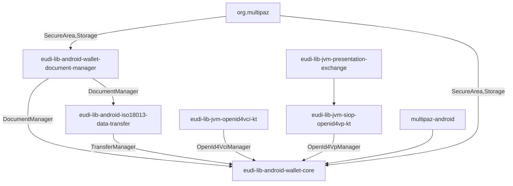

# EUDI Wallet Core library for Android

**Important!** Before you proceed, please read
the [EUDI Wallet Reference Implementation project description](https://github.com/eu-digital-identity-wallet/.github/blob/main/profile/reference-implementation.md)

## Overview

This repository contains the EUDI Wallet Core library for Android. The library is a part
of the EUDI Wallet Reference Implementation project.

This library acts as a coordinator by orchestrating the various components that are
required to implement the EUDI Wallet functionality. On top of that, it provides a simplified API
that can be used by the application to implement the EUDI Wallet functionality.



### Features

The library supports the following features:

| Category                   | Feature                                                                 | Status                                                                                 |
|----------------------------|-------------------------------------------------------------------------|----------------------------------------------------------------------------------------|
| **Document Management**    | Documents' Key creation and management with Android Keystore by default | ✅                                                                                      |
|                            | Custom Key Management implementation                                    | ✅ via imeplementation of SecureArea                                                    |
|                            | Multiple Key Management implementations                                 | ✅                                                                                      |
|                            | Support for Batch credentials per Document                              | ✅                                                                                      |
| **Document Issuance**      | OpenId4VCI (draft 15) document issuance                                 |                                                                                        |
|                            | Authorization Code Flow                                                 | ✅                                                                                      |
|                            | Pre-authorization Code Flow                                             | ✅                                                                                      |
|                            | DPoP JWT in authorization                                               | ✅                                                                                      |
|                            | Credential Formats                                                      | ✅ mso_mdoc format <br /> ✅ sd-jwt-vc format                                            |
|                            | Credential issuance                                                     | ✅ Wallet initiated issuance  <br /> ✅ Via credential Offer                             |
|                            | Proof                                                                   | ✅ JWT                                                                                  |
|                            | Credential batch issuing                                                | ✅ multiple JWT proofs                                                                  |
|                            | Deferred issuing                                                        | ✅                                                                                      |
|                            | Notify credential issuer                                                | ❌                                                                                      |
| **Proximity Presentation** | ISO-18013-5 device retrieval                                            |                                                                                        |
|                            | Device engagement                                                       | ✅ QR <br /> ✅ NFC                                                                      |
|                            | Data transfer                                                           | ✅ BLE <br /> ❌ NFC <br /> ❌ Wifi-Aware                                                 |
| **Remote Presentation**    | OpenID for Verifiable Presentations 1.0                                 |                                                                                        |
|                            | ClientID scheme                                                         | ✅ preregistered   <br /> ✅ x509_san_dns<br /> ✅ x509_hash <br /> ✅ redirect_uri        |
|                            | DCQL                                                                    | ✅ simple queries   <br />❌ support for credential_sets  <br />❌ support for claim_sets |

The library is written in Kotlin and is compatible with Java. It is distributed as a Maven package
and can be included in any Android project that uses Android 8 (API level 26) or higher.

## Disclaimer

The released software is an initial development release version:

- The initial development release is an early endeavor reflecting the efforts of a short timeboxed
  period, and by no means can be considered as the final product.
- The initial development release may be changed substantially over time, might introduce new
  features but also may change or remove existing ones, potentially breaking compatibility with your
  existing code.
- The initial development release is limited in functional scope.
- The initial development release may contain errors or design flaws and other problems that could
  cause system or other failures and data loss.
- The initial development release has reduced security, privacy, availability, and reliability
  standards relative to future releases. This could make the software slower, less reliable, or more
  vulnerable to attacks than mature software.
- The initial development release is not yet comprehensively documented.
- Users of the software must perform sufficient engineering and additional testing in order to
  properly evaluate their application and determine whether any of the open-sourced components is
  suitable for use in that application.
- We strongly recommend not putting this version of the software into production use.
- Only the latest version of the software will be supported

## Requirements

- Android 8 (API level 26) or higher

### Dependencies

To use snapshot versions add the following to your project's settings.gradle file:

```groovy

dependencyResolutionManagement {
    repositories {
        // ...
        maven {
            url = uri("https://central.sonatype.com/repository/maven-snapshots/")
            mavenContent { snapshotsOnly() }
        }
        // ...
    }
}
```

To include the library in your project, add the following dependencies to your app's build.gradle
file.

```groovy
dependencies {
    implementation "eu.europa.ec.eudi:eudi-lib-android-wallet-core:0.21.0-SNAPSHOT"
    // required when using the built-in AndroidKeystoreSecureArea implementation provided by the library
    // for user authentication with biometrics
    implementation "androidx.biometric:biometric-ktx:1.2.0-alpha05"
}
```

## How to Use

### Initialize the library

To instantiate a `EudiWallet` use the `EudiWallet.Builder` class or the `EudiWallet.invoke` method,
from the EudiWallet companion object.

The minimum requirements to initialize the library is to provide a `EudiWalletConfig` object that
will be used to configure the library's built-in components.

The built-in components are:

- `AndroidKeystoreSecureArea` for storing and managing the documents' keys
- `AndroidStorage` for storing the documents' data
- `ReaderTrustStore` implementation for validating the reader's certificates
- `PresentationManager` implementation for managing both proximity and remote presentation of
  documents
- `Logger` implementation for logging
- `DocumentStatusResolver` implementation for checking document revocation status

The following example demonstrates how to initialize the library for using the built-in components:

```kotlin
// configuring the wallet
val storageFile = File(applicationContext.noBackupFilesDir.path, "main.db")
val config = EudiWalletConfig()
    // configure the document storage
    // the noBackupFilesDir is used to store the documents by default
    .configureDocumentManager(storageFile.absolutePath)
    // configure the built-in logger
    .configureLogging(
        // set log level to info
        level = Logger.LEVEL_INFO
    )
    // configure the built-in key creation settings
    .configureDocumentKeyCreation(
        // set userAuthenticationRequired to true to require user authentication
        userAuthenticationRequired = true,
        // set userAuthenticationTimeout to 30 seconds
        userAuthenticationTimeout = 30_000L,
        // set useStrongBoxForKeys to true to use the the device's StrongBox if available
        // to store the keys
        useStrongBoxForKeys = true
    )
    .configureReaderTrustStore(
        // set the reader trusted certificates for the reader trust store
        listOf(readerCertificate)
    )
    // configure the OpenId4Vci service
    .configureOpenId4Vci {
        withIssuerUrl("https://issuer.com")
        withClientId("client-id")
        withAuthFlowRedirectionURI("eudi-openid4ci://authorize")
        withParUsage(OpenId4VciManager.Config.ParUsage.Companion.IF_SUPPORTED)
        withDPoPUsage(OpenId4VciManager.Config.DPoPUsage.IfSupported(
            algorithm = Algorithm.ESP256 // this is the default value, that can be omitted
        ))
        // or withDPoPUsage(OpenId4VciManager.Config.DPoPUsage.Disabled)
    }
    // configuration for proximity presentation
    // the values below are the default values
    .configureProximityPresentation(
        // ble mode: peripheral and/or central
        enableBlePeripheralMode = true,
        enableBleCentralMode = false,
        clearBleCache = true,
        // registered application service for handling NFC device engagement
        nfcEngagementServiceClass = MyNfcEngagementService::class.java
    )
    // configure the OpenId4Vp service
    .configureOpenId4Vp {
        withClientIdSchemes(
            ClientIdScheme.X509SanDns
        )
        withSchemes(
            "openid4vp",
            "eudi-openid4vp",
            "mdoc-openid4vp"
        )
        withFormats(
            Format.MsoMdoc.ES256,
            Format.SdJwtVc.ES256
        )
    }
    // configure document status resolver with 5 minutes clock skew tolerance
    .configureDocumentStatusResolver(clockSkewInMinutes = 5)

// Create the wallet instance with default components
val wallet = EudiWallet(context, config)

// Or create the wallet with custom component implementations
val customWallet = EudiWallet(context, config) {
    // custom Storage to store documents' data
    withStorage(myStorage)
    // a list of SecureArea implementations to be used
    withSecureAreas(listOf(deviceSecureArea, cloudSecureArea))
    // ReaderTrustStore to be used for reader authentication
    withReaderTrustStore(myReaderTrustStore)
    // custom logger to be used
    withLogger(myLogger)
    // custom HTTP client for network operations
    withKtorHttpClientFactory { HttpClient(OkHttp) { /* custom config */ } }
    // custom transaction logger for auditing
    withTransactionLogger(myTransactionLogger)
    // custom document status resolver
    withDocumentStatusResolver(myDocumentStatusResolver)
}
```

See the [CustomizeSecureArea.md](CustomizeSecureArea.md) for more information on how to use the
wallet-core library with custom SecureArea implementations.

### Manage documents

The library provides a set of methods to work with documents.

#### Retrieving documents

The following snippet shows how to retrieve all documents:

```kotlin
// Get all documents in the wallet
val documents = wallet.getDocuments()
```

You can also retrieve documents based on a predicate. The following snippet shows how to retrieve documents of mso_mdoc format of a specific docType:

```kotlin
// Get documents filtered by a specific docType
val documents = wallet.getDocuments { document ->
    (document.format as? MsoMdocFormat)?.docType == "eu.europa.ec.eudi.pid.1"
}

// Get only issued documents (excluding deferred documents)
val issuedDocuments = wallet.getDocuments { document ->
    document is IssuedDocument
}

// Combine multiple conditions
val specificDocuments = wallet.getDocuments { document ->
    document is IssuedDocument && 
    (document.format as? SdJwtVcFormat)?.vct == "IdentityCredential" 
}
```

The following snippet shows how to retrieve a document by its id:

```kotlin
val documentId = "some_document_id"
val document: Document? = wallet.getDocumentById(documentId)

// You can also cast to a specific document type if needed
val issuedDocument = wallet.getDocumentById(documentId) as? IssuedDocument
val deferredDocument = wallet.getDocumentById(documentId) as? DeferredDocument
```

##### Working with Credentials in Issued Documents

Issued documents provide methods to work with individual credentials:

```kotlin
val issuedDocument = documentManager.getDocumentById("document_id") as? IssuedDocument
requireNotNull(issuedDocument)

// Get the number of valid credentials for the document
val numberOfValidCredentials = issuedDocument.credentialsCount()

// Get the initial number of credentials for the document
val initialNumberOfCredentials = issuedDocument.initialCredentialsCount()

// Get a list of all valid credentials for the document
val validCredentials = issuedDocument.getCredentials()

// Find an available credential (automatically selects the best one based on policy)
val credential = issuedDocument?.findCredential()

// Use a credential and apply the policy (e.g., delete if OneTimeUse, increment usage if RotateUse)
issuedDocument?.consumingCredential {
    // Use the credential for presentation or other operations
    // The credential policy will be applied automatically after this block
    performPresentationWithCredential(this)
}
```

The `findCredential()` method intelligently selects credentials based on:

- Credential policy (e.g., OneTimeUse or RotateUse)
- Usage count (selecting least-used credentials first in RotateUse policy)
- Validity period (ensuring the credential is currently valid)
- Availability (excluding deleted or invalidated credentials)

#### Deleting documents

To delete a document, use the following code snippet:

```kotlin
try {
    val documentId = "some_document_id"
    val deleteResult = wallet.deleteDocumentById(documentId)
    deleteResult.getOrThrow()
} catch (e: Throwable) {
    // Handle the exception
}
```

#### Resolving document status

The wallet-core library provides functionality to check the revocation status of documents. This is useful to verify if a document is still valid or has been revoked.

To check the status of a document, you can use the `resolveStatusById` method on the `EudiWallet` instance:

```kotlin
// Get a document's ID
val documentId = "some_document_id"

// Check the document's status
wallet.resolveStatusById(documentId).fold(
    onSuccess = { status ->
        when (status) {
            Status.Valid -> println("Document is valid")
            Status.Invalid -> println("Document is invalid")
            Status.Suspended -> println("Document is suspended")
            is Status.ApplicationSpecific -> println("Application-specific status: ${status.value}")
            is Status.Reserved -> println("Reserved status: ${status.value}")
        }
    },
    onFailure = { error ->
        // Handle errors (network issues, document not found, etc.)
    }
)
```

You can also check the status of a document directly if you have an `IssuedDocument` instance:

```kotlin
val document = wallet.getDocumentById(documentId) as? IssuedDocument
if (document != null) {
    wallet.resolveStatus(document).fold(
        onSuccess = { status ->
            // Handle the status
        },
        onFailure = { error ->
            // Handle errors
        }
    )
}
```

For more details on document management, see the [Document Manager repository](https://github.com/eu-digital-identity-wallet/eudi-lib-android-wallet-document-manager/blob/v0.11.1/README.md).

##### Document Status Resolution Configuration

By default, the library uses a built-in implementation of `DocumentStatusResolver` that works with token status lists as specified in various credential formats. The resolver supports both MSO MDOC and SD-JWT VC document formats.

###### Basic Configuration

You can configure the default implementation using `EudiWalletConfig`:

```kotlin
val config = EudiWalletConfig()
    // Configure a clock skew allowance (in minutes) for token verification
    .configureDocumentStatusResolver(clockSkewInMinutes = 5)
    // ... other configurations
```

###### Custom DocumentStatusResolver Implementation

For more advanced customization, you can provide your own custom implementation of `DocumentStatusResolver` during wallet initialization:

```kotlin
val wallet = EudiWallet(context, config) {
    // Custom HTTP client factory for status resolution if needed
    withKtorHttpClientFactory { HttpClient(OkHttp) { /* custom configuration */ } }

    // Or a completely custom document status resolver
    withDocumentStatusResolver(myCustomDocumentStatusResolver)
}
```

You can also create your own DocumentStatusResolver using the builder:

```kotlin
// Create a custom DocumentStatusResolver
val customResolver = DocumentStatusResolver {
    // Configure verification mechanism
    withVerifySignature(VerifyStatusListTokenSignature.x5c)
    
    // Configure clock skew tolerance
    withAllowedClockSkew(Duration.minutes(5))
    
    // Custom HTTP client factory
    withKtorHttpClientFactory { 
        HttpClient(CIO) { 
            // Custom client configuration 
        } 
    }
    
    // Custom status reference extractor if needed
    withExtractor(MyCustomStatusReferenceExtractor)
}

// Use the custom resolver during wallet initialization
val wallet = EudiWallet(context, config) {
    withDocumentStatusResolver(customResolver)
}
```

### Issue document using OpenID4VCI

The library provides issuing documents using OpenID4VCI protocol. To issue a document
using this functionality, EudiWallet must be initialized with the `openId4VciConfig` configuration,
during configuration. See the [Initialize the library](#initialize-the-library) section.

#### Creating an OpenId4VciManager

First, you need an instance of the `OpenId4VciManager` class. You can create an instance of the
class by calling the `EudiWallet.createOpenId4VciManager` method:

```kotlin
// Create an instance of OpenId4VciManager using wallet-wide configuration
val openId4VciManager = wallet.createOpenId4VciManager()

// Or provide a specific configuration for this instance
val customConfig = OpenId4VciManager.Config.Builder()
    .withIssuerUrl("https://custom-issuer.com")
    .withClientId("custom-client-id")
    .withAuthFlowRedirectionURI("eudi-openid4ci://custom-authorize")
    .build()
    
val openId4VciManagerWithCustomConfig = wallet.createOpenId4VciManager(customConfig)

// You can also provide a custom HTTP client factory
val openId4VciManagerWithCustomHttpClient = wallet.createOpenId4VciManager(
    config = customConfig,
    ktorHttpClientFactory = {
        HttpClient(OkHttp) {
            // Custom HTTP client configuration
        }
    }
)
```

##### How configuration is resolved

The `createOpenId4VciManager` method can accept an optional `OpenId4VciManager.Config` parameter:

1. If you provide a configuration parameter, that configuration will be used for the created manager instance.
2. If you don't provide a configuration parameter, the method will attempt to use the configuration from `EudiWalletConfig.openId4VciConfig`.
3. If neither are provided, the method will throw an `IllegalStateException` with a message indicating that you need to provide configuration either as a method parameter or in the `EudiWalletConfig`.

This flexibility allows you to:
- Use a single global configuration for all OpenId4VCI operations by configuring it once in `EudiWalletConfig`
- Override the global configuration for specific operations by passing a custom configuration
- Provide a custom HTTP client for specific operations while using the global configuration

#### Resolving Credential offer

The library provides the `OpenId4VciManager.resolveDocumentOffer` method that resolves the
credential offer URI.
The method returns the resolved [`Offer`](wallet-core/src/main/java/eu/europa/ec/eudi/wallet/issue/openid4vci/Offer.kt) object that contains the offer's data. The offer's 
data can be displayed to the user.

The following example shows how to resolve a credential offer:

```kotlin
val offerUri = "https://issuer.com/?credential_offer=..."
// Create an instance of OpenId4VciManager
val openId4VciManager = wallet.createOpenId4VciManager()
openId4VciManager.resolveDocumentOffer(offerUri) { result ->

    when (result) {
        is OfferResult.Success -> {
            val offer: Offer = result.offer
            // display the offer's data to the user
            val issuerName = offer.issuerName
            val offeredDocuments: List<OfferedDocument> = offer.offeredDocuments
            val txCodeSpec: Offer.TxCodeSpec? =
                offer.txCodeSpec // information about pre-authorized flow
            // ...
        }
        is OfferResult.Failure -> {
            val error = result.cause
            // handle error while resolving the offer
        }
    }
}
```

There is also the availability for the `OpenId4VciManager.resolveDocumentOffer` method to specify
the executor in which the onResolvedOffer callback is executed, by assigning the `executor`
parameter. If the `executor` parameter is null, the callback will be executed on the main thread.

```kotlin
val executor = Executors.newSingleThreadExecutor()
openId4VciManager.resolveDocumentOffer(offerUri, executor) { result ->
    // ...
}
```

#### Issuing a document

First, you need an instance of the `OpenId4VciManager` class. You can create an instance of the
class by calling the `EudiWallet.createOpenId4VciManager` method.

There are two ways to issue a document using OpenID4VCI:

1. Using the `OpenId4VciManager.issueDocumentByFormat` method, when the document's format is
   known. In case of MsoMdoc format, the docType is required. In case of SdJwtVc format, vct is
   required.
2. Using the `OpenId4VciManager.issueDocumentByOffer` or `OpenId4VciManager.issueDocumentByOfferUri`
   methods, when an OpenId4VCI offer is given.
3. Using the `issueDocumentByConfigurationIdentifier` method, when the document's configuration
   identifier is known. The configuration identifiers can be retrieved from the issuer's metadata,
   using the `getIssuerMetadata` method.

__Important note__:

- Currently, only the ES256 algorithm is supported for signing OpenId4CVI proof of possession of the
  publicKey.
- See
  the [CustomizeSecureArea.md](CustomizeSecureArea.md#how-to-use-custom-key-management-with-openid4vci)
  for more information on how to use the wallet-core library and OpenId4VCI with custom SecureArea
  implementations.

The following example shows how to issue a document using OpenID4VCI:

```kotlin
val onIssueEvent = OnIssueEvent { event ->
    when (event) {
        is IssueEvent.Started -> {
            // Process started, show progress
            val numberOfDocumentsToBeIssued = event.total
        }

        is IssueEvent.DocumentRequiresCreateSettings -> {
            // Need to provide settings for document creation
            // Create document settings can be varied depending on the document type
            
            val format = event.offeredDocument.documentFormat
            val isEuPid = when(format) {
                is MsoMdocFormat -> format.docType == "eu.europa.ec.eudi.pid.1"
                is SdJwtVcFormat -> format.vct == "urn:eudi:pid:1"
                else -> false
            }
            val createDocumentSettings = when {
                isEuPid -> eudiWallet.getDefaultCreateDocumentSettings(
                    offeredDocument = event.offeredDocument,
                    numberOfCredentials = 5,
                    credentialPolicy = CreateDocumentSettings.CredentialPolicy.OneTimeUse
                )


                else -> eudiWallet.getDefaultCreateDocumentSettings(
                    offeredDocument = event.offeredDocument,
                    numberOfCredentials = 1,
                    credentialPolicy = CreateDocumentSettings.CredentialPolicy.RotateUse
                )
            }
            // Resume with settings
            event.resume(createDocumentSettings)

            // Or cancel
            // event.cancel("User cancelled")
        }

        is IssueEvent.Finished -> {
            // All documents issued, show success
            val issuedDocumentIds = event.issuedDocuments
        }

        is IssueEvent.Failure -> {
            // Overall process failed
            val cause = event.cause
        }

        is IssueEvent.DocumentIssued -> {
            // Individual document issued successfully
            val documentId = event.documentId
            val documentName = event.name
            val docType = event.docType
        }

        is IssueEvent.DocumentFailed -> {
            // Individual document failed to issue
            val documentName = event.name
            val docType = event.docType
            val cause = event.cause
        }

        is IssueEvent.DocumentRequiresUserAuth -> {
            // Document requires user authentication to sign
            val signingAlgorithm = event.signingAlgorithm
            val document = event.document

            // Create keyUnlockData (e.g., prompt for biometrics)
            val keyUnlockData = event.keysRequireAuth.mapValues { (keyAlias, secureArea) ->
                getDefaultKeyUnlockData(secureArea, keyAlias)
            }

            // Resume after authentication
            event.resume(keyUnlockData)

            // Or cancel the process
            // event.cancel("User cancelled authentication")
        }

        is IssueEvent.DocumentDeferred -> {
            // Issuance is deferred (will be issued later)
            val documentId = event.documentId
            val documentName = event.name
            val docType = event.docType
        }
    }
}
// Create an instance of OpenId4VciManager
val openId4VciManager = wallet.createOpenId4VciManager()

// Issue by document type
openId4VciManager.issueDocumentByFormat(
    format = MsoMdocFormat(docType = "eu.europa.ec.eudi.pid.1"),
    txCode = "123456", // For pre-authorized flow
    onIssueEvent = onIssueEvent
)

// Or by offer URI
openId4VciManager.issueDocumentByOfferUri(
    offerUri = "https://issuer.com/?credential_offer=...",
    txCode = "123456", // Optional
    onIssueEvent = onIssueEvent
)

// Or by resolved offer
openId4VciManager.issueDocumentByOffer(
    offer = offer,
    txCode = "123456", // Optional
    onIssueEvent = onIssueEvent
)
```

There's also available for `issueDocumentByFormat`, `issueDocumentByOfferUri` and
`issueDocumentByOffer` methods to specify the executor in which the onIssueEvent callback is
executed, by assigning the `executor` parameter. If the `executor` parameter is null, the callback
will be executed on the main thread.

```kotlin
// Create an instance of OpenId4VciManager
val openId4VciManager = wallet.createOpenId4VciManager()

val executor = Executors.newSingleThreadExecutor()
openId4VciManager.issueDocumentByDocType(
    docType = "eu.europa.ec.eudi.pid.1",
    executor = executor
) { event ->
    // ...
}
```

#### Authorization code flow

For the authorization code flow to work, the application must handle the redirect URI. The redirect
URI is the URI that the Issuer will redirect the user to after the user has authenticated and
authorized. The redirect
URI must be handled by the application and resume the issuance process by calling the
`OpenId4VciManager.resumeWithAuthorization`.
Also, the redirect uri declared in the OpenId4VCI configuration must be declared in the
application's manifest file.

__Important note__: The `resumeWithAuthorization` method must be called from the same
OpenId4VciManager instance that was used to start the issuance process. You will need to keep the
reference of the `OpenId4VciManager` instance that was used for calling the
`issueDocumentByFormat`, `issueDocumentByOfferUri` or `issueDocumentByOffer` method and use this
same instance to call the `resumeWithAuthorization` method.

```xml

<!-- AndroidManifest.xml -->
<manifest xmlns:android="http://schemas.android.com/apk/res/android">
    <application>
        <!-- rest of manifest -->
        <activity android:name=".MainActivity" android:exported="true">
            <!-- rest of activity -->
            <intent-filter>
                <action android:name="android.intent.action.VIEW" />

                <category android:name="android.intent.category.DEFAULT" />
                <category android:name="android.intent.category.BROWSABLE" />

                <data android:scheme="eudi-openid4ci" android:host="authorize" />
            </intent-filter>
        </activity>
    </application>
</manifest>
```

```kotlin 
 // ...
EudiWalletConfig()
    // ... 
    .configureOpenId4Vci {
        // ...
        withAuthFlowRedirectionURI("eudi-openid4ci://authorize")
        // ...
    }
//...
```

```kotlin
class SomeActivity : AppCompatActivity() {

    val openId4VciManager: OpenId4VciManager
        get() {
            // get the OpenId4VciManager instance that was created during the issuance process
            // ...
        }

    // ...
    override fun onResume() {
        super.onResume()
        // check if intent is from the redirect uri to resume the issuance process
        // ...
        // then call
        intent.data?.let { uri -> openId4VciManager.resumeWithAuthorization(uri) }
    }
    // ...
}
```

#### Pre-Authorization code flow

When Issuer supports the pre-authorization code flow, the resolved offer will also contain the
corresponding information. Specifically, the `txCodeSpec` field in the `Offer` object will contain:

- The input mode, whether it is NUMERIC or TEXT
- The expected length of the input
- The description of the input

From the user's perspective, the application must provide a way to input the transaction code.

When the transaction code is provided, the issuance process can be resumed by calling any of the
following methods:

- `EudiWallet.issueDocumentByConfigurationIdentifier`
- `EudiWallet.issueDocumentByFormat`
- `EudiWallet.issueDocumentByOfferUri`
- `EudiWallet.issueDocumentByOffer`

passing the transaction code as in the `txCode` parameter.

#### Deferred Issuance

When the document issuance is deferred, the `IssueEvent.DocumentDeferred` event is triggered. The
deferred document can be issued later by calling the `OpenId4VciManager.issueDeferredDocument`
method.

```kotlin
// given a deferred document, for example:
val deferredDocumentId: DocumentId = "deferred-document-id"
val deferredDocument = wallet.getDocumentById(deferredDocumentId) as DeferredDocument

val openId4VciManager: OpenId4VciManager = wallet.createOpenId4VciManager()

openId4VciManager.issueDeferredDocument(deferredDocument) { result ->
    when (result) {
        is DeferredIssueResult.DocumentIssued -> {
            // document issued
        }
        is DeferredIssueResult.DocumentFailed -> {
            // error
            val cause = result.cause
        }
        is DeferredIssueResult.DocumentNotReady -> {
            // The document is not issued yet
        }
        is DeferredIssueResult.DocumentExpired -> {
            // The document is expired and cannot be issued
        }
    }
}
```

### Transfer documents

The library supports the following 3 ways to transfer documents:

1. Offline document transfer between devices over BLE, according to the ISO 18013-5 specification
    - Device engagement using QR code
    - NFC device engagement
2. Document retrieval to a website according to the ISO 18013-7 specification
    - RestAPI using app link
3. Document retrieval using OpenID4VP

The transfer process is asynchronous. During the transfer, events are emitted that indicate the current
state of the transfer. The following events are emitted:

1. `TransferEvent.QrEngagementReady`: The QR code is ready to be displayed. Get the QR code from
   `event.qrCode`.
2. `TransferEvent.Connecting`: The devices are connecting. Use this event to display a progress
   indicator.
3. `TransferEvent.Connected`: The devices are connected.
4. `TransferEvent.RequestReceived`: A request is received. Get the parsed request from
   `event.requestedDocumentData`
   and the initial request as received by the verifier from `event.request`.
5. `TransferEvent.ResponseSent`: A response is sent.
6. `TransferEvent.Redirect`: This event prompts to redirect the user to the given Redirect URI.
   Get the Redirect URI from `event.redirectUri`. This event maybe be returned when OpenId4Vp is
   used as a transmission channel.
7. `TransferEvent.Disconnected`: The devices are disconnected.
8. `TransferEvent.Error`: An error occurred. Get the `Throwable` error from `event.error`.

#### Attaching a TransferEvent.Listener

To receive events from the `EudiWallet`, you must attach a `TransferEvent.Listener` to it:

The following example demonstrates how to implement a `TransferEvent.Listener` and attach it to the
`EudiWallet` object.

```kotlin
wallet.addTransferEventListener { event ->
    when (event) {
        is TransferEvent.QrEngagementReady -> {
            // Qr code is ready to be displayed
            val qrCodeBitmap = event.qrCode.asBitmap(size = 800)
            // or
            val qrCodeView = event.qrCode.asView(context, size = 800)
        }

        TransferEvent.Connecting -> {
            // Informational event that devices are connecting
        }

        TransferEvent.Connected -> {
            // Informational event that the transfer has been connected
        }

        is TransferEvent.RequestReceived -> try {
            // get the processed request
            val processedRequest = event.processedRequest.getOrThrow()
            // the request has been received and processed

            // the request processing was successful
            // requested documents can be shown in the application
            val requestedDocuments = processedRequest.requestedDocuments
            // ...
            // application must create the DisclosedDocuments object
            val disclosedDocuments = DisclosedDocuments(
                // assume that the document is in mso_mdoc format
                DisclosedDocument(
                    documentId = "document-id",
                    disclosedItems = listOf(
                        MsoMdocItem(
                            namespace = "eu.europa.ec.eudi.pid.1",
                            elementIdentifier = "first_name"
                        ),
                    ),
                    // keyUnlockData is required if needed to unlock the key
                    // in order to sign the response
                    keyUnlockData = wallet.getDefaultKeyUnlockData("document-id")
                ),
                // ... rest of the disclosed documents
            )
            // generate the response
            val response = processedRequest.generateResponse(
                disclosedDocuments = disclosedDocuments,
                signatureAlgorithm = Algorithm.ES256
            ).getOrThrow()

            wallet.sendResponse(response)

        } catch (e: Throwable) {
            // An error occurred
            // handle the error
        }

        TransferEvent.ResponseSent -> {
            // Informational event that the response has been sent
        }

        is TransferEvent.Redirect -> {
            // A redirect is needed. Used mainly for the OpenId4VP implementation
            // This is triggered when Relaying Party (RP) has accepted the response and
            // the RP is redirecting the user to the given redirect URI
            // If this event is triggered, then the TransferEvent.ResponseSent event will not be triggered
            val redirectUri = event.redirectUri // the redirect URI
        }

        TransferEvent.Disconnected -> {
            // Informational event that device has been disconnected
            // stop the proximity presentation
            wallet.stopProximityPresentation()
        }

        is TransferEvent.Error -> {
            // An error occurred
            val cause = event.error
            // stop the proximity presentation
            wallet.stopProximityPresentation()
        }
    }
}
```

#### Initiating transfer

1. BLE transfer using QR Engagement

   Once a transfer event listener is attached, use the `EudiWallet.startProximityPresentation()`
   method to start the QR code engagement.

    ```kotlin
    wallet.startProximityPresentation()
    
    //... other code
    
    // in event listener when the qr code is ready to be displayed
    when (event) {
        is TransferEvent.QrEngagementReady -> {
            // show the qr code to the user
            val qrCode: QrCode = event.qrCode
            val qrBitmap = qrCode.asBitmap(size = 512) // get the qr code as bitmap
            // - or -
            val qrView = qrCode.asView(context, size = 512) // get the qr code as view
        }
        // ... rest of the event types
        else -> {}
    }
    ```
2. BLE transfer using NFC Engagement

   To use NFC for engagement, you must implement a service that extends the abstract class
   `NfcEngagementService` and register it in your application's manifest file, like shown below:

    ```xml
    
    <application>
        <!-- rest of manifest -->
        <service android:exported="true" android:label="@string/nfc_engagement_service_desc"
                android:name="com.example.app.MyNfcEngagementService"
                android:permission="android.permission.BIND_NFC_SERVICE">
            <intent-filter>
                <action android:name="android.nfc.action.NDEF_DISCOVERED" />
                <action android:name="android.nfc.cardemulation.action.HOST_APDU_SERVICE" />
            </intent-filter>
    
            <!-- the following "@xml/nfc_engagement_apdu_service" in meta-data is provided by the library -->
            <meta-data android:name="android.nfc.cardemulation.host_apdu_service"
                    android:resource="@xml/nfc_engagement_apdu_service" />
        </service>
    
    </application>
    ```

   Then the service class must be also declared during wallet configuration using the
   `EudiWalletConfig.configureProximityPresentation` method. For example
   see [Initialize the library](#initialize-the-library) section.

   In your application you can enable or disable the NFC engagement in your app by calling the
   `wallet.enableNFCEngagement(ComponentActivity)` and
   `wallet.disableNFCEngagement(ComponentActivity)`
   methods.

   In the example below, the NFC engagement is enabled when activity is resumed and disabled
   when the activity is paused.

    ```kotlin
    import androidx.appcompat.app.AppCompatActivity
    
    class MainActivity : AppCompatActivity() {
        
        lateinit var wallet: EudiWallet
    
        override fun onResume() {
            super.onResume()
            wallet.enableNFCEngagement(this)
        }
    
        override fun onPause() {
            super.onPause()
            wallet.disableNFCEngagement(this)
        }
    }
    ```

3. RestAPI using app link

   To enable ISO 18013-7 REST API functionality, declare to your app's manifest file
   (AndroidManifest.xml) an Intent Filter for your MainActivity:

    ```xml
    <intent-filter>
        <action android:name="android.intent.action.VIEW" />
        <category android:name="android.intent.category.DEFAULT" />
        <category android:name="android.intent.category.BROWSABLE" />
        <data android:scheme="mdoc" android:host="*" />
    </intent-filter>
    ```

   and set `launchMode="singleTask"` for this activity.

   To initiate the transfer using an app link (reverse engagement), use the
   `wallet.startRemotePresentation(Uri)` method. See the example below:

    ```kotlin
    class MainActivity : AppCompatActivity() {
    
        lateinit var wallet: EudiWallet
        // ... rest of activity code
    
        override fun onResume() {
            super.onResume()
            wallet.startRemotePresentation(intent.data!!)
        }
    
        override fun onNewIntent(intent: Intent) {
            super.onNewIntent(intent)
            wallet.startRemotePresentation(intent.data!!)
        }
    }
    ```
   To cancel the remote presentation, call the `wallet.stopRemotePresentation()` method.

4. OpenID4VP

   To use the OpenID4VP functionality, the configuration that is used to initialize the library
   must contain the `openId4VpConfig`. See the [Initialize the library](#initialize-the-library)
   section.

   Then, declare to your app's manifest file (AndroidManifest.xml) the following Intent Filters for
   your MainActivity, for the scheme:

    ```xml
    <intent-filter>
       <action android:name="android.intent.action.VIEW" />
       <category android:name="android.intent.category.DEFAULT" />
       <category android:name="android.intent.category.BROWSABLE" />
       <data android:scheme="mdoc-openid4vp" android:host="*" />
    </intent-filter> 
    ```

   Also set `launchMode="singleTask"` for this activity.

    ```kotlin
    class MainActivity : AppCompatActivity() {
        
        lateinit var wallet: EudiWallet
        // ... rest of activity code
    

        override fun onResume() {
            super.onResume()
            handleOpenId4VpIntent(intent)
        }

        override fun onNewIntent(intent: Intent) {
            super.onNewIntent(intent)
            setIntent(null)
            handleOpenId4VpIntent(intent)
        }

        private fun handleOpenId4VpIntent(intent: Intent) {
            val uri = intent.data!!
            wallet.startRemotePresentation(uri)
        }
    }
    ```
   To cancel the remote presentation, call the `wallet.stopRemotePresentation()` method.

#### Receiving a request and sending a response

When a `TransferEvent.RequestReceived` event is triggered, the processed request can be obtained by
calling `event.processedRequest`. If the request is successfully processed, the requested
documents are extracted from the `processedRequest` object.

The application then show the requested documents to the user and later create a
`DisclosedDocuments` object, which includes the documents to be disclosed in the response. Each
`DisclosedDocument` must contain the `documentId` of the disclosed document, a list of `DocItem`
objects representing the disclosed items, and `keyUnlockData` if needed to unlock the key for
signing the response.

After creating the `DisclosedDocuments` object, a response can be generated using the
`processedRequest.generateResponse` method, specifying the disclosed documents and the signature
algorithm (`Algorithm.ES256`). The generated response is then sent using the `wallet.sendResponse`
method.

```kotlin
val transferEventListener = TransferEvent.Listener { event ->
    when (event) {

        is TransferEvent.RequestReceived -> try {
            // get the processed request
            val processedRequest = event.processedRequest.getOrThrow()
            // the request has been received and processed

            // the request processing was successful
            // requested documents can be shown in the application
            val requestedDocuments = processedRequest.requestedDocuments
            // ...
            // application must create the DisclosedDocuments object
            // Here for simplicity we assume that the first document is the only requested document
            // and we disclose only the first name

            // get the first document by id
            val firstDocumentId = requestedDocuments.first().documentId

            val firstDocument = wallet.getDocumentById(firstDocumentId) as IssuedDocument
            // We also assume that it requires user authentication
            // so we create the keyUnlockData to unlock the key
            val keyUnlockData = firstDocument.DefaultKeyUnlockData
            val cryptoObject = keyUnlockData.getCryptoObjectForSigning(Algorithm.ES256)
            // authenticate the user using the cryptoObject
            // ...

            val disclosedDocuments = DisclosedDocuments(
                DisclosedDocument(
                    documentId = firstDocumentId,
                    disclosedItems = listOf(
                        MsoMdocItem(
                            namespace = "eu.europa.ec.eudi.pid.1",
                            elementIdentifier = "first_name"
                        ),
                    ),
                    // keyUnlockData is required if needed to unlock the key
                    // in order to sign the response
                    keyUnlockData = keyUnlockData
                ),
                // ... rest of the disclosed documents
            )
            // generate the response
            val response = processedRequest.generateResponse(
                disclosedDocuments = disclosedDocuments,
                signatureAlgorithm = Algorithm.ES256
            ).getOrThrow()

            wallet.sendResponse(response)

        } catch (e: Throwable) {
            // An error occurred
            // handle the error
        }
        // handle other events
        else -> {}
    }
}
```

See also,
the [CustomizeSecureArea.md](CustomizeSecureArea.md#how-to-use-custom-key-management-with-presentation)
for more information on how to use the wallet-core library for presentation with custom SecureArea
implementations.

### Transaction Logging

The library supports logging transactions for auditing and analytics purposes. Currently, only presentation transactions (both proximity and remote) are supported by the library. Issuing transactions will be added in a future release.

#### Configuring Transaction Logger

To enable transaction logging, you need to implement the `TransactionLogger` interface and provide it when initializing the `EudiWallet` instance:

```kotlin
// Implement the TransactionLogger interface
class MyTransactionLogger : TransactionLogger {
    override fun log(transaction: TransactionLog) {
        // Implement logging logic here
        // For example, save transaction to a local database
    }
}

// Then provide it when creating the wallet instance
val wallet = EudiWallet(context, config) {
    // other configurations
    withTransactionLogger(MyTransactionLogger())
}
```

#### Working with Transaction Logs

Transaction logs contain information about the presentation transaction, such as:
- Timestamp of the transaction
- Transaction status (Completed, Error, Incomplete)
- Type of transaction (currently only Presentation is supported)
- Relying party information
- Raw request and response data
- Format of the data (CBOR, JSON)

Here's an example of how to retrieve and parse a presentation transaction log:

```kotlin
// Assuming you have a TransactionLog object from your storage
val transactionLog: TransactionLog = retrieveTransactionLog()

// Check if it's a presentation transaction
if (transactionLog.type == TransactionLog.Type.Presentation) {
    // Parse the presentation transaction log
    val presentationLogResult = PresentationTransactionLog.fromTransactionLog(transactionLog)
    
    presentationLogResult.onSuccess { presentationLog ->
        // Access the parsed information
        val timestamp = presentationLog.timestamp
        val status = presentationLog.status
        val relyingParty = presentationLog.relyingParty
        
        // Access the presented documents and claims
        for (document in presentationLog.documents) {
            val format = document.format
            val metadata = document.metadata
            
            // Access individual claims
            for (claim in document.claims) {
                val path = claim.path
                val value = claim.value
                // Process the claim...
            }
        }
    }
    
    presentationLogResult.onFailure { error ->
        // Handle parsing error
    }
}
```

This parsed information can be used to display transaction history to the user, perform audits, or for any other analytical purposes.

## How to contribute

We welcome contributions to this project. To ensure that the process is smooth for everyone
involved, follow the guidelines found in [CONTRIBUTING.md](CONTRIBUTING.md).

## License

### Third-party component licenses

See [licenses.md](licenses.md) for details.

### License details

Copyright (c) 2023 European Commission

Licensed under the Apache License, Version 2.0 (the "License");
you may not use this file except in compliance with the License.
You may obtain a copy of the License at

    http://www.apache.org/licenses/LICENSE-2.0

Unless required by applicable law or agreed to in writing, software
distributed under the License is distributed on an "AS IS" BASIS,
WITHOUT WARRANTIES OR CONDITIONS OF ANY KIND, either express or implied.
See the License for the specific language governing permissions and
limitations under the License.
`
